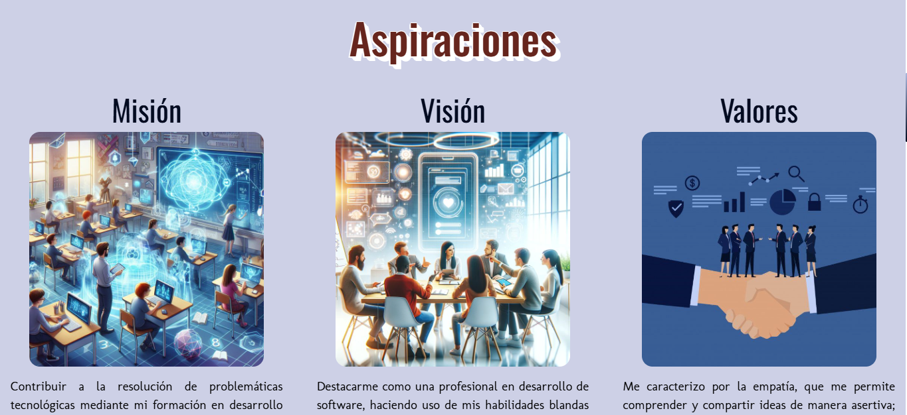
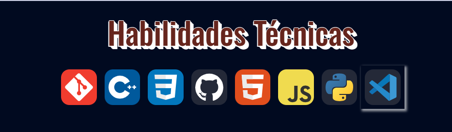
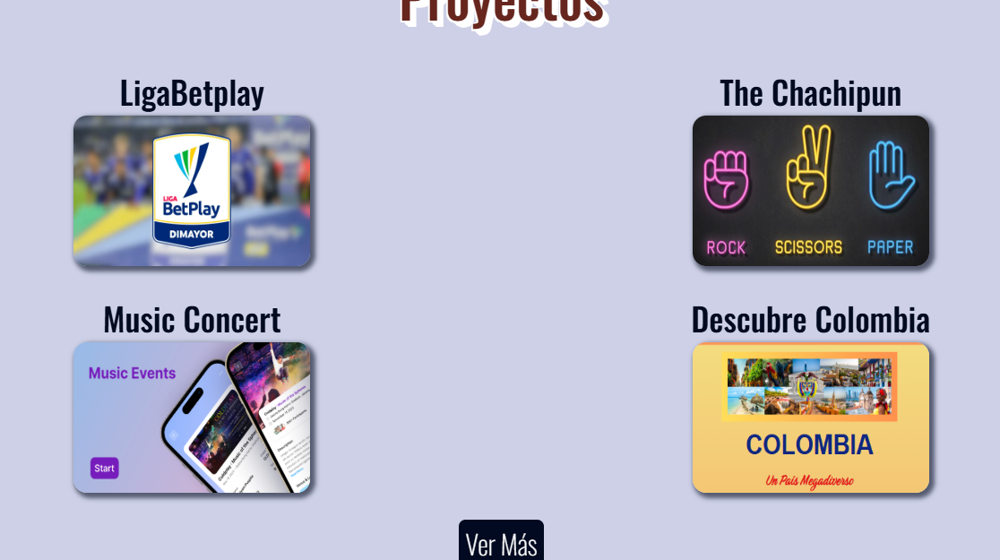
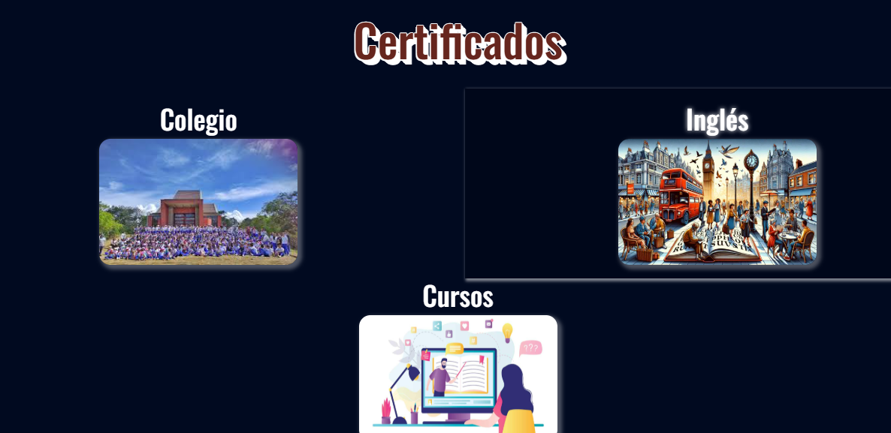

# Portafolio Profesional

Mediante este repositorio se desarrolla un Portafolio Profesional, el cual incluye información como: Sobre Mi, Aspiraciones, Conocimientos Técnicos, Certificados de estudio e información de contacto.
Para la visualización del Portafolio Profesional siga el siguiente enlace:
**https://lauravargas22.github.io/PortafolioLV/**

## Cover:

Por medio de la página principal se realizó una página de presentación en la cual se puede visualizar tanto el nombre como una imágen. En este se encuentra un botón el cual dirige al usuario a la página home.

## Home:

En esta página se desarrollarán secciones con la información ya mencionada anteriormente.

### Sobre Mi:

Esta sección está dividida en columnas cada un con un color de fondo diferente, el primera se encuentra una imágen con un menú de navegación, con el cual el usuario podrá navegar a la sección seleccionada de acuerdo con el id de la misma. En la segunda, se encuentran datos personales correspondientes.


### Aspiraciones:

En la segunda sección, se encontrarán tres columnas con información sobre misión, visión y valores, para la visualización de esto se implementó Bootstrap de está manera:

1. Emparejamiento de Bootstrap en HTML:
    ```
    <link href="https://cdn.jsdelivr.net/npm/bootstrap@5.3.3/dist/css/bootstrap.min.css" rel="stylesheet" integrity="sha384-QWTKZyjpPEjISv5WaRU9OFeRpok6YctnYmDr5pNlyT2bRjXh0JMhjY6hW+ALEwIH" crossorigin="anonymous">
    ```

2. Organización del HTML en contenedores, se tiene un contenedor principal en el cual se encuentran otros tres, en donde en cada uno se tiene la información correspondiente a lo mencionado previamente:
    ```
    <div class="row row-cols-1 row-cols-md-3 row-cols-lg-3">
        <!--Columna 1 (Misión)-->
        <div class="col">
            <!--Título de la columna-->
            <h2 class="items__title">Misión</h2>
            <!--Imágen de la columna-->
            
            <!--Descripción de la columna-->
            <p class="items__text">Contribuir a la resolución de problemáticas tecnológicas mediante mi formación en desarrollo de software y el uso de habilidades blandas, fomentando un entorno inclusivo y efectivo que impulse el progreso en la sociedad.</p>
        </div>
    ```

    En el primer contador se especifica por medio de la clase que se van a tener columnas horizontales de acuerdo al tamaño de pantalla por lo que en celular y tablet se va a ver de a una y en laptop de las tres.
    


### Conocimientos Técnicos:
Para esta sección se hizo uso de cada uno de los logos de las tecnologías o lenguajes de programación con el fin de compartir los Conocimientos técnicos, así mismp se aplicaron estilos a cada uno para realizar un box-shadow al hacer hover.


### Proyectos:
En está sección se implementó Bootstrap de igual forma para la visualización de cada uno de los proyectos en columnas, al seleccionar en cada contenedor se permitirá redireccionar al usuario al repositorio donde se realizó dicho proyecto:

```
<div class="col__proyects">
    <!--Redireccionamiento al repositorio del proyecto-->
    <a class="link" href="https://github.com/LauraVargas22/LigaBetplay" target="_blank">
        <!--Título de la columna-->
        <h2 class="proyects__title">LigaBetplay</h2>
        <!--Imágen de la columna-->
        
    </a>
</div>
```

En la parte inferior de la sección se encuentra el botón "Ver más" con el fin de que el usuario se diriga a mi cuenta de Github.


### Certificados de Estudio:
En la cuarta sección se encuentran tres tipos de certificados en torno al colegio, inglés y cursos relacionados al área TI.
Al hacer hover en cada uno de los contenedores el usuario se puede dirigir a una carpeta de drive donde se encuentran los certificados correspondientes.


### Contacto:
En está última sección, se encuentra un cuadro de texto en donde el usuario se podrá comunicar vía email.
```
<a class="email" href="mailto:lauramarianavargasrojas22@gmail.com">Contáctame</a>
```


### Footer:
En el pie de página se encuentra nombre completo e íconos de direccionamiento al usuario a perfiles profesionales de Github y Linkedin.

